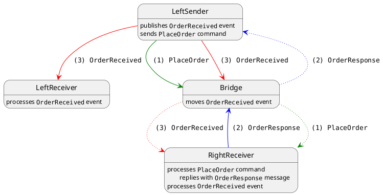
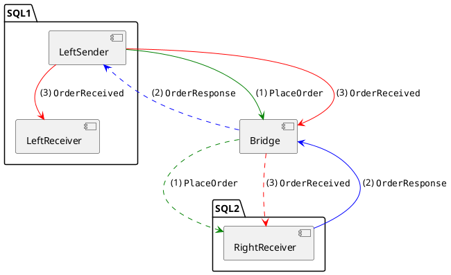

Mimicking Particular example `bridge > simple > Bridge_2`, replacing learning transport with SQL Server transport.



> "Local" subscriptions need not configuration in the bridge: messages are delivered directly, there's no need for the bridge to be aware of those routes.



```puml
box Left side #EEFFDD
  participant LeftReceiver as lr
  participant LeftSender as ls
end box

participant Bridge as b
participant RightReceiver as rr

ls -> b : ""PlaceOrder""
b -[dashed]> rr : ""PlaceOrder""

rr -> b : ""OrderResponse""
b -[dashed]> ls : ""OrderResponse""

activate ls
ls -> lr : ""OrderReceived""
ls -> b : ""OrderReceived""
deactivate ls

b -[dashed]> rr : ""OrderReceived""
```


## Detailed analysis

- When `LeftSender` sends `PlaceOrder` command, header `NServiceBus.ReplyToAddress` is set to ...
- When the bridge moves the command to the final recipient `RightReceiver`, header `NServiceBus.ReplyToAddress` is set to `Samples.Bridge.LeftSender@[dbo]@[Samples.Bridge.Right]`.
- When `RightReceiver` processes the command, it sends `OrderResponse` (using `Reply`) back to `LeftSender`.
- The bridge moved the message to the final recipient `LeftSender`.

  Question: how does the bridge know `LeftSender` queue is in general? 
  
  I guess it works because for each bridge endpoint, the bridge knows which NServiceBus endpoint it connects to, e.g.

  ```csharp
  /* ... */
  leftBridgeTransport.HasEndpoint("Samples.Bridge.LeftSender");  
  /* ... */
  rightBridgeTransport.HasEndpoint(rightReceiver);
  ```
  
  > We can register many NServiceBus endpoints for one bridge endpoint.  

- `LeftSender` processes `OrderResponse`